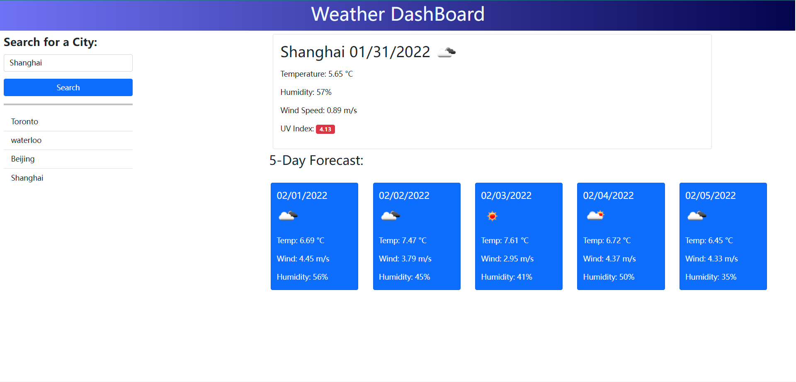

# Weather-Dashboard

## Description

The project creates a weather dashboard which will run in the browser and will feature dynamically updated HTML and CSS powered by JavaScript code. It uses OpenWeather One Call API to retrieve data for cities. User can search one specific city and it will show the current weather condition include the Temperature, Humidity, Wind Speed and UV Index. It will also display 5-day weather forecast. User can switch city in the searching history section. Once user load the website or reload it, the last searched city will be displayed.


## Link

Click [here](https://jotaroc.github.io/Weather-Dashboard/) to the deployed website

## Acceptance Criteria

```
GIVEN a weather dashboard with form inputs
WHEN I search for a city
THEN I am presented with current and future conditions for that city and that city is added to the search history
WHEN I view current weather conditions for that city
THEN I am presented with the city name, the date, an icon representation of weather conditions, the temperature, the humidity, the wind speed, and the UV index
WHEN I view the UV index
THEN I am presented with a color that indicates whether the conditions are favorable, moderate, or severe
WHEN I view future weather conditions for that city
THEN I am presented with a 5-day forecast that displays the date, an icon representation of weather conditions, the temperature, the wind speed, and the humidity
WHEN I click on a city in the search history
THEN I am again presented with current and future conditions for that city
```

## Screenshot

The following image is the sceenshot of web application's appearance and functionality:



---
Author:Xingzhi Chang
